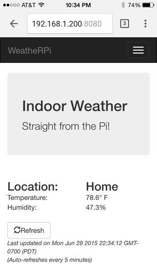

WeatheRPi
=========

Indoor Weather web app (and REST API) powered by a [Raspberry Pi](https://www.raspberrypi.org).

The web interface looks like this -

Weather data can also be obtained using a REST API (`GET /api`). Example -

    $ curl 192.168.1.200:8080/api
    {"place": "Home", "temperature": {"units": "F", "value": 81.7}, "humidity": 44.6}

Hardware Details
----------------
You will need the following -

- Raspberry Pi (any model)
- DHT-22 (or DHT-11) temperature/humidity sensor
- 10k resistor (as pull-up)

### Connections
For the DHT, pin 1 is the leftmost (when facing the front i.e. the "grid" side) and pin 4 is the rightmost.

- Pin 1 -> 3V3
- Pin 2 -> Data to BCM GPIO #4 (change code to use other pins)
- Pin 2 -> 10k resistor -> 3V3
- Pin 3 - Not used
- Pin 4 -> Ground

Installation
------------

### Pre-requisites
This code uses the [`Adafruit_DHT`](https://github.com/adafruit/Adafruit_Python_DHT) library to talk to the DHT sensor. The easiest way to install it is using `pip` (`sudo` will be required if not using a [virtual environment](https://virtualenv.pypa.io/en/latest/index.html)) -

    $ pip install git+https://github.com/adafruit/Adafruit_Python_DHT

If that fails, installing a few things may be required -

    $ sudo apt-get install python-pip build-essential python-dev python-openssl

### Configuration
This step is required only if the defaults need to be changed. The code uses the following defaults -

- Web server is started on port 8080
- Data pin is connected to BCM GPIO #4 on the Raspberry Pi
- Sensor used is DHT-22

These can be changed in [weatherpi.py](weatherpi.py)

### Running the web server

It needs to be run with root previliges to be able to use GPIO.

    $ sudo python weatherpi.py

License
-------
FreeBSD
